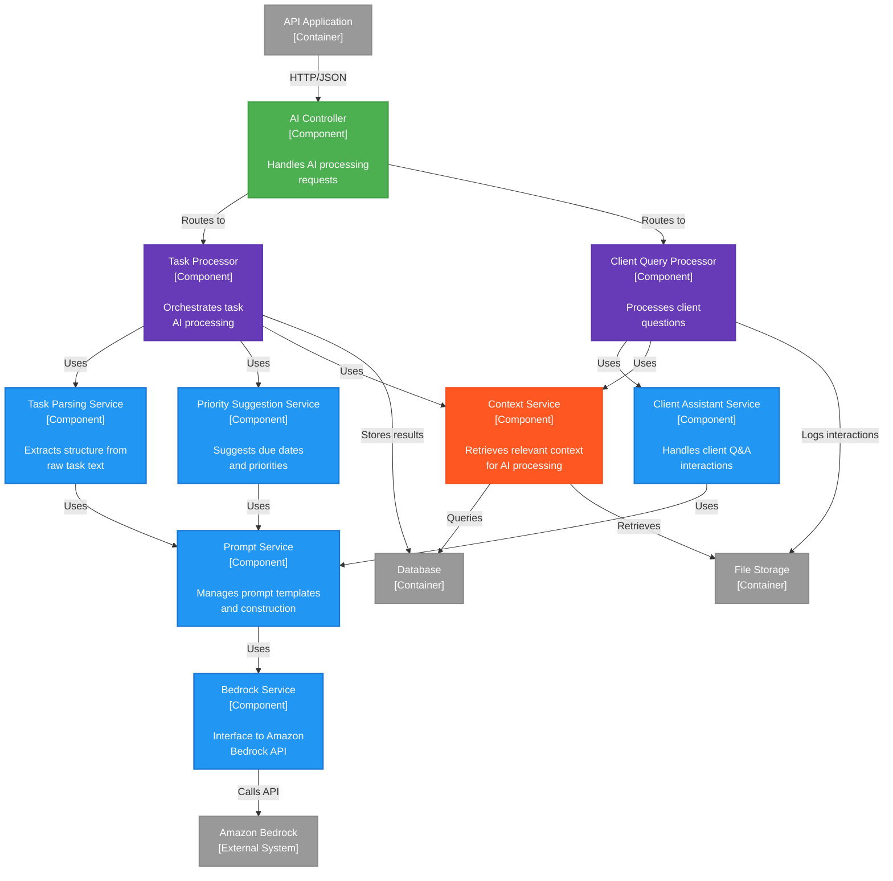

# Component Diagram: AI Service

**C4 Level**: 3
**Type**: Component
**Scope**: Internal structure of the AI Service container
**Primary Elements**: Components within the AI Service for processing AI requests
**Intended Audience**: Developers, AI/ML engineers
**Last Updated**: 2025-05-11

## Purpose

This diagram shows the internal component structure of the AI Service, illustrating how different AI capabilities are organized and how they interact with Amazon Bedrock and other system components.

## Diagram

## Legend

| Shape/Color | Meaning                           |
| ----------- | --------------------------------- |
| Green       | Controller components             |
| Blue        | Service components                |
| Purple      | Processor/Orchestrator components |
| Orange      | Context management components     |
| Gray        | External containers/systems       |

## Key Elements

### Controllers

- **AI Controller**: Single entry point for all AI processing requests from the API Application

### Core Services

- **Task Parsing Service**: Extracts structured information (client, project, dates) from unstructured text
- **Priority Suggestion Service**: Analyzes tasks to suggest priorities and due dates
- **Client Assistant Service**: Handles natural language Q&A for client inquiries

### Supporting Services

- **Context Service**: Retrieves relevant context (client history, project details) for AI processing
- **Prompt Service**: Manages prompt templates and constructs prompts with injected context
- **Bedrock Service**: Wraps Amazon Bedrock API calls, handles retries and error handling

### Processors

- **Task Processor**: Orchestrates the complete task AI processing workflow
- **Client Query Processor**: Manages the client Q&A workflow with appropriate context

## Key Relationships

1. API App → AI Controller: All AI requests come through single controller
1. Controller → Processors: Routes to appropriate processor based on request type
1. Processors → Services: Orchestrate multiple services for complete workflows
1. Services → Prompt Service: All AI services use centralized prompt management
1. Prompt Service → Bedrock: Single point of integration with Amazon Bedrock
1. Context Service → Storage: Retrieves context from both database and files

## Notes and Constraints

- Each AI service is optimized for different model characteristics
- Prompt templates are version controlled and environment-specific
- Context window limits are managed by the Prompt Service
- All AI interactions are logged for auditing and improvement
- Processors handle retry logic and fallback strategies
- Results are cached where appropriate to reduce costs

## Related Documentation

- [ADR-005: AI Integration Architecture](../ADRs/ADR-005.md)
- [Container Diagram](./c4-container-diagram.md)
