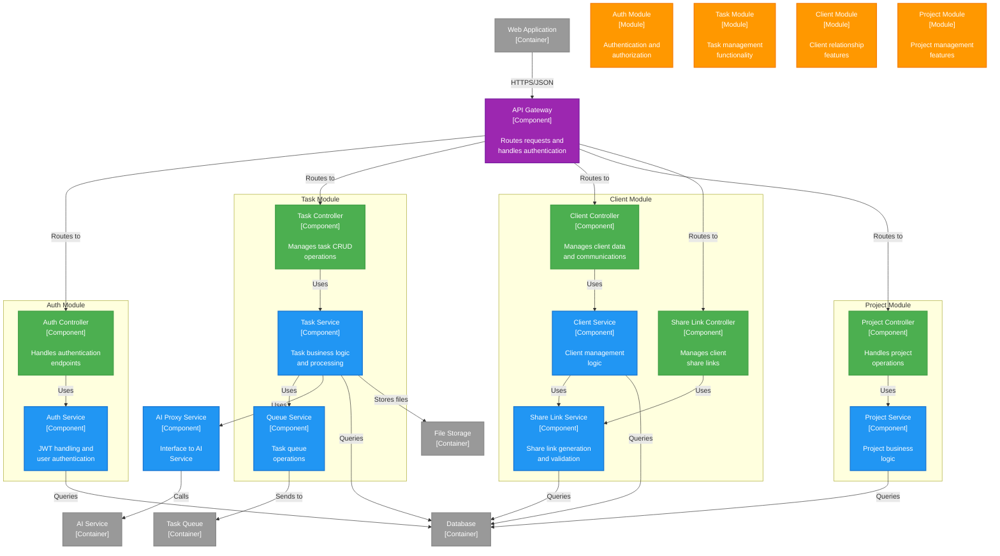

# Component Diagram: API Application

**C4 Level**: 3
**Type**: Component
**Scope**: Internal structure of the API Application container
**Primary Elements**: Components, controllers, services, and modules within the API
**Intended Audience**: Developers, technical architects
**Last Updated**: 2025-05-11

## Purpose

This diagram shows the internal component structure of the API Application, illustrating how the Nest.js modules are organized and how they interact to provide the REST API functionality.

## Diagram

## Legend

| Shape/Color | Meaning                             |
| ----------- | ----------------------------------- |
| Purple      | API Gateway component               |
| Green       | Controller components               |
| Blue        | Service components                  |
| Orange      | Nest.js modules (logical groupings) |
| Gray        | External containers                 |

## Key Elements

### Controllers

- **Auth Controller**: Handles /auth/\* endpoints for login, signup, and token refresh
- **Task Controller**: Manages /tasks/\* endpoints for CRUD operations
- **Client Controller**: Handles /clients/\* endpoints for client management
- **Project Controller**: Manages /projects/\* endpoints
- **Share Link Controller**: Handles /share-links/\* endpoints for client access

### Services

- **Auth Service**: Manages JWT tokens, password hashing, and authentication logic
- **Task Service**: Contains task business logic, validation, and orchestration
- **Client Service**: Handles client data management and communication tracking
- **Project Service**: Manages project lifecycle and relationships
- **Share Link Service**: Generates and validates share links for clients
- **Queue Service**: Interfaces with AWS SQS for async processing
- **AI Proxy Service**: Communicates with the AI Service container

### Modules

- **Auth Module**: Encapsulates authentication functionality
- **Task Module**: Groups task-related components
- **Client Module**: Contains client management components
- **Project Module**: Organizes project functionality

## Key Relationships

1. Gateway → Controllers: All requests routed through controllers
1. Controllers → Services: Business logic separated into services
1. Services → External Containers: Data persistence and external operations
1. Cross-Service Communication: Services can use other services (e.g., TaskService uses QueueService)
1. Module Boundaries: Components grouped by domain

## Notes and Constraints

- All controllers use dependency injection for services
- Guards are applied at controller level for authentication
- Services handle transaction boundaries
- Database access is abstracted through repository pattern
- All external communications go through dedicated services
- Modules enforce separation of concerns

## Related Documentation

- [ADR-009: API Design](../ADRs/ADR-009.md)
- [Container Diagram](./c4-container-diagram.md)
- [Component Diagram - AI Service](./c4-ai-service-component-diagram.md)
