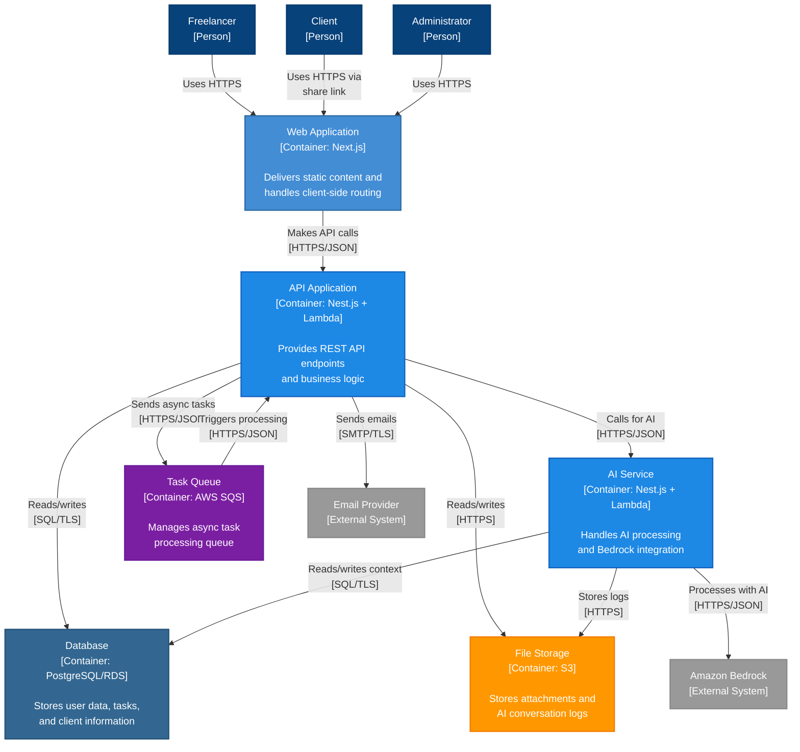

# Container Diagram: SmartStack

**C4 Level**: 2
**Type**: Container
**Scope**: The SmartStack system internals
**Primary Elements**: Applications, databases, and services within SmartStack
**Intended Audienc**e: Technical stakeholders, developers, DevOps
**Last Updated**: 2025-01-12

## Purpose

This diagram shows the high-level containers (applications and data stores) that make up SmartStack, along with the major technology choices and communication patterns between them.

## Diagram

## Legend

| Shape/Color    | Meaning                   |
| -------------- | ------------------------- |
| Blue (darker)  | Person/User               |
| Blue (medium)  | Web application container |
| Blue (lighter) | API/Service containers    |
| Blue (dark)    | Database                  |
| Orange         | File storage              |
| Purple         | Message queue             |
| Grey           | External systems          |

## Key Elements

### Applications

- **Web Application**: Next.js application serving the user interface, handles routing and client-side logic
- **API Application**: Nest.js application deployed on AWS Lambda, provides REST endpoints and core business logic
- **AI Service**: Separate Nest.js Lambda function for AI operations, interfaces with Amazon Bedrock

### Data Stores

- **Database**: PostgreSQL on AWS RDS storing all structured data (users, tasks, clients, projects)
- **File Storage**: Amazon S3 for storing files, attachments, and AI conversation logs

### Infrastructure

- **Task Queue**: AWS SQS for asynchronous task processing, enabling resilient AI processing

### External Systems

- **Amazon Bedrock**: AI/LLM service for intelligent features
- **Email Provider**: External email service for notifications and task ingestion

## Key Relationships

1. Web App → API: All data operations go through the API (REST/JSON over HTTPS)
1. API → Database: Persistent data storage with encrypted connections
1. API → Task Queue: Asynchronous processing for AI tasks
1. API → AI Service: Dedicated service for AI operations
1. AI Service → Bedrock: External AI processing
1. Both API and AI Service → File Storage: Shared file access

## Notes and Constraints

- All containers are deployed to AWS infrastructure
- API and AI Service run as AWS Lambda functions behind API Gateway
- Database connections use connection pooling for Lambda
- All inter-service communication is encrypted
- Task Queue ensures AI processing doesn't block user operations
- AI Service is separate to allow independent scaling

## Related Documentation

- [ADR-001: Task Processing Architecture](../ADRs/ADR-001.md)
- [ADR-005: AI Integration Architecture](../ADRs/ADR-005.md)
- [ADR-007: Environment & Deployment Architecture](../ADRs/ADR-007.md)
- [System Context Diagram](c4-system-context.md)
- Component Diagram - API
