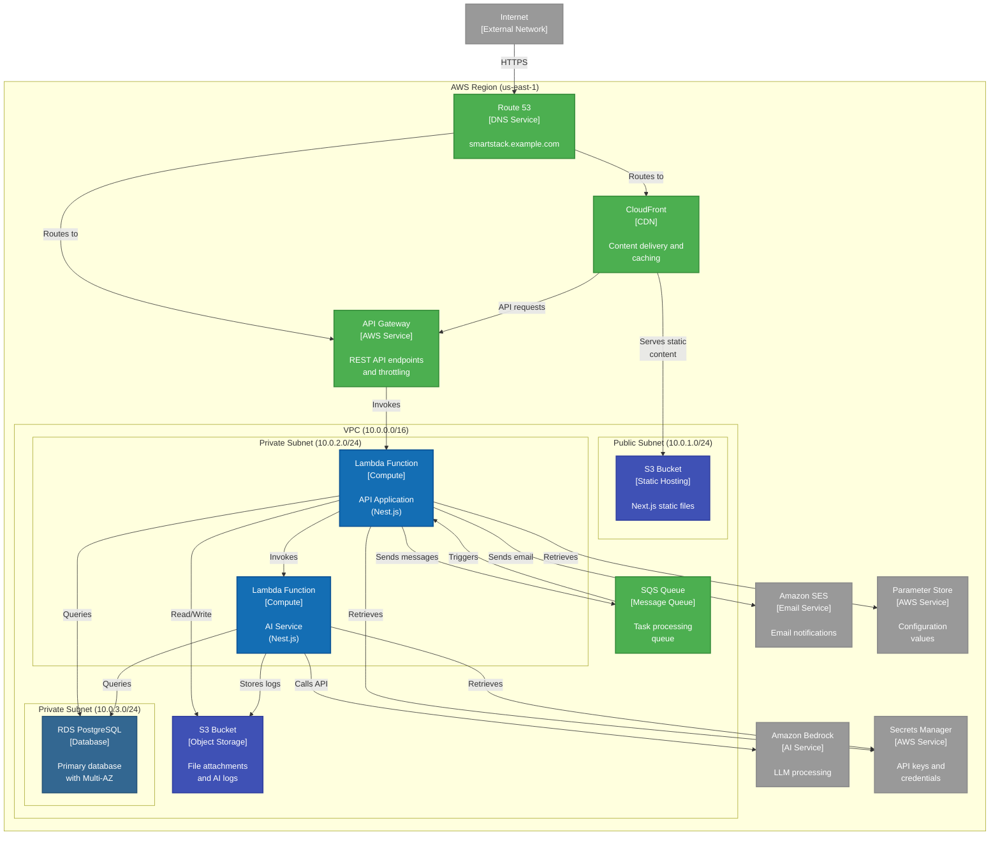

# Deployment Diagram: SmartStack

**C4 Level**: 3
**Type**: Deployment
**Scope**: How SmartStack is deployed to AWS infrastructure
**Primary Elements**: AWS services, deployment nodes, and container instances
**Intended Audience**: DevOps engineers, infrastructure team, developers
**Last Updated**: 2025-01-12

## Purpose

This diagram shows how SmartStack containers are deployed to AWS infrastructure across development, staging, and production environments, including the relationships between AWS services.

## Diagram

## Legend

| Shape/Color | Meaning                          |
| ----------- | -------------------------------- |
| Orange      | AWS infrastructure nodes         |
| Blue        | Application containers/functions |
| Dark Blue   | Database instances               |
| Indigo      | Storage services                 |
| Green       | Network services                 |
| Gray        | External services                |

## Key Elements

### Network Layer

- **Route 53**: DNS management and routing
- **CloudFront**: CDN for static content and API caching
- **API Gateway**: REST API management, throttling, and authentication

### Compute Layer

- **Lambda Functions**: Serverless compute for API and AI services
- **VPC**: Network isolation with public and private subnets

### Storage Layer

- **S3 (Web)**: Static website hosting for Next.�frontend
- **S3 (Files)**: Object storage for attachments and logs
- **RDS PostgreSQL**: Relational database with Multi-AZ for high availability

### Integration Layer

- **SQS**: Message queue for asynchronous task processing
- **Bedrock**: AI/LLM service integration
- **SES**: Email service for notifications

### Security Layer

- **Secrets Manager**: Secure storage for API keys and credentials
- **Parameter Store**: Configuration management
- **VPC**: Network isolation and security groups

## Environment Separation

Each environment (dev, staging, prod) has:

- Separate AWS account or isolated resources
- Independent VPC with same network architecture
- Environment-specific configuration in Parameter Store
- Isolated databases and S3 buckets
- Environment-prefixed resource names

## Key Relationships

1. Internet → CloudFront → S3: Static content delivery path
1. Internet → API Gateway → Lambda: API request path
1. Lambda → RDS: Database operations within VPC
1. Lambda → SQS → Lambda: Asynchronous processing pattern
1. Lambda → Bedrock: External AI service integration

## Notes and Constraints

- Lambda functions are deployed in private subnets for security
- RDS is Multi-AZ for high availability
- All inter-service communication uses IAM roles
- Secrets are never stored in code or environment variables
- CloudFront provides DDoS protection
- API Gateway handles rate limiting

## Related Documentation

- [ADR-007: Environment & Deployment Architecture](../ADRs/ADR-007.md)
- [Container Diagram](c4-container-diagram.md)
