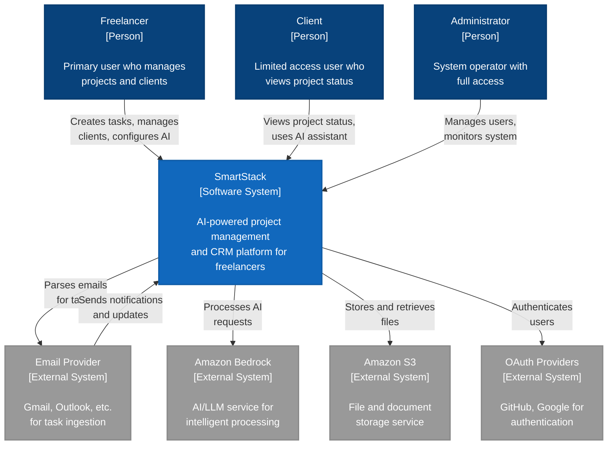

# System Context Diagram: SmartStack

**C4 Level**: 1
**Type**: System Context
**Scope**: SmartStack and its external dependencies
**Primary Elements**: Users, SmartStack system, and external integrations
**Intended Audience**: All stakeholders (technical and business)
**Last Updated**: 2025-05-11

## Purpose

This diagram shows SmartStack's position in its environment, illustrating who uses the system and what external systems it depends on for its core functionality.

## Diagram

## Legend

| Shape/Color                 | Meaning                       |
| --------------------------- | ----------------------------- |
| Blue boxes with person icon | People/Users of the system    |
| Darker blue box             | The SmartStack system itself  |
| Gray boxes                  | External systems and services |
| Arrows                      | Data flow and interactions    |

## Key Elements

### People

- Freelancer: Primary user who creates and manages tasks, tracks client communications, and configures AI processing
- Client: External user with limited access via share links, can use AI assistant for project inquiries
- Administrator: System operator responsible for user management and system monitoring

## Software Systems

- SmartStack: The central system providing task management, client relationship management, and AI-powered assistance

## External Systems

- Email Provider: Integrates for task creation from emails and sending notifications
- Amazon Bedrock: Provides AI capabilities for task processing and client assistance
- Amazon S3: Stores files, attachments, and AI conversation logs
- OAuth Providers: Handles user authentication (GitHub, future: Google)

## Key Relationships

1. Freelancer → SmartStack: Full system access for project and client management
1. Client → SmartStack: Limited access through share links for project visibility
1. SmartStack → Email: Bidirectional for task ingestion and notifications
1. SmartStack → Bedrock: AI processing for intelligent features
1. SmartStack → S3: File storage and retrieval
1. SmartStack → OAuth: User authentication and authorization

## Notes and Constraints

- Clients do not have direct login credentials; they access via share links
- All AI processing is done through Amazon Bedrock service
- Email integration is critical for task capture functionality
- System must maintain strict data isolation between different freelancers

## Related Documentation

- [ADR-005: AI Integration Architecture](../ADRs/ADR-005.md)
- [ADR-006: Data Storage Architecture](../ADRs/ADR-006.md)
- [ADR-008: Authentication & Authorization](../ADRs/ADR-008.md)
- [Container Diagram](c4-container-diagram.md)
